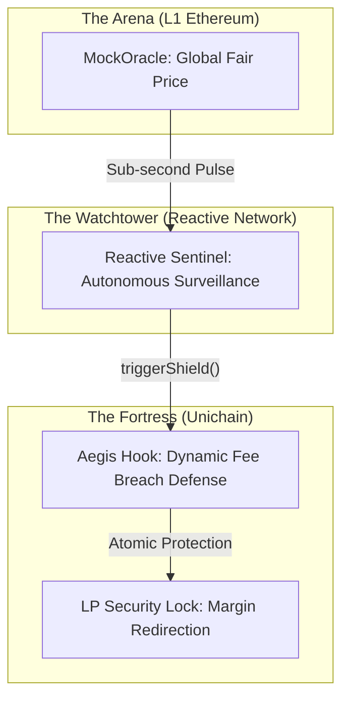

# 🛡️ Aegis Prime: The Tactical Liquidity Fortress

```text
      _      _____  ____ ___ ____    ____  ____  ___ __  __ _____ 
     / \    | ____|/ ___|_ _/ ___|  |  _ \|  _ \|_ _|  \/  | ____|
    / _ \   |  _| | |  _ | |\___ \  | |_) | |_) || || |\/| |  _|  
   / ___ \  | |___| |_| || | ___) | |  __/|  _ < | || |  | | |___ 
  /_/   \_\ |_____|\____|___|____/  |_|   |_| \_\___|_|  |_|_____|
                                                                    
```

**Stop being the target. Start being the predator.**

Traditional Liquidity Provision is a passive, defenseless game. You park your capital and hope the arbitrage bots don't bleed you dry during volatility. In the cross-chain arena, they are the hunters, and you are the prey.

**Aegis Prime flips the script.** We don't just "provide liquidity." We deploy a **Tactical Command Center** that detects toxic flow before it even lands and captures the attacker's margin as protocol profit.

---

## ⚔️ The Combat Narrative: "Turning the Hunter into the Prey"

### The Old World: The Defenseless LP
Meet **Alice**, a passive LP. When a market crash strikes Ethereum Mainnet, Alice is in a "Dead Zone." Arbitrage bots see the crash milliseconds before the oracles. They race to hit her pool on Unichain, draining value before she even knows the market has moved. Alice takes the **Loss Versus Rebalancing (LVR)** and pays for the bot's luxury car.

### The Aegis World: The Counter-Strike
Alice deploys on **Aegis Prime**. She is no longer a victim; she is the **Maker of the Ambush**. 

1.  **Surveillance**: Across the horizon, the **Reactive Sentinel** monitors the L1 sub-second pulse.
2.  **Detection**: A crash hits. Before the first bot transaction even reaches the Unichain mempool, the Sentinel fires a cross-chain strike.
3.  **The Trap**: The **Equilibrium Shield** arms instantly. The Aegis Hook overrides the pool fee with a **99.9% Dynamic Security Tax**.
4.  **Margin Capture**: The bots arrive, expecting a feast. Instead, they hit the Shield. Their entire arbitrage margin is captured by the protocol and redirected back to Alice.

**Alice isn't just protected. She's winning the PvP game.**

---

## 🗺️ Tactical Architecture



---

## 🏗️ Technical Command (Deep Dives)

We don't settle for "standard" code. Every line is hardened for the cross-chain battlefield:

*   **[🎯 Tactical Contracts (The Shield)](./contracts/README.md)**: Explore the **Uniswap v4 Hook** implementation, high-fidelity security overrides, and the autonomous cross-chain callback engine.
*   **[📡 The Command Center (Frontend)](./frontend/README.md)**: Deep dive into the **Unified PriceContext**, real-time radar HUD, and the high-performance Web3 stack.
*   **[🛰️ The Radar (Relayer)](./frontend/relay.ts)**: Analyze the **Persistent State-Sync Engine** and self-healing nonce management.

---

## 📍 Protocol Manifest (Operational Addresses)

### 🌐 Unichain Sepolia (Chain ID: 1301)
*The battlefield where liquidity is defended.*

| Component | Address |
| :--- | :--- |
| **AegisHook (V4)** | `0xc9d1fed83361fa922d5d479071d2957029ca8080` |
| **PoolManager (v4)** | `0x00B036B58a818B1BC34d502D3fE730Db729e62AC` |

### 🌐 Ethereum Sepolia (L1 Reference)
*The source of the global truth.*

| Component | Address |
| :--- | :--- |
| **MockOracle** | `0xe7e31164b5b50a107dbab71de6edde5b7cb96c0d` |

### 🌐 Reactive Network (Lasna) (Chain ID: 5318007)
*The autonomous brain of the Sentinel.*

| Component | Address |
| :--- | :--- |
| **AegisSentinel** | `0x0f764437ffbe1fcd0d0d276a164610422710b482` |

---

## 🛡️ Operational Status
- **Current Mode**: **Defensive Hardened**
- **Shield Type**: **Reactive Dynamic Hook**
- **Target Network**: **Unichain / Reactive Ecosystem**

---
© 2026 Aegis Prime Protocol | Hardened by Senior Engineering
