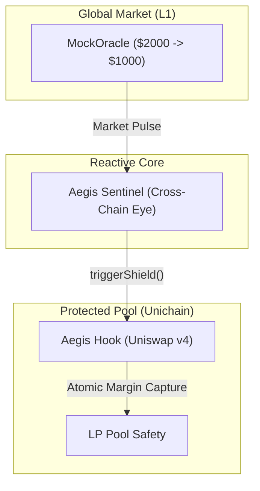

# 🛡️ Aegis Prime: The Autonomous Liquidity Shield

```text
      _      _____  ____ ___ ____    ____  ____  ___ __  __ _____ 
     / \    | ____|/ ___|_ _/ ___|  |  _ \|  _ \|_ _|  \/  | ____|
    / _ \   |  _| | |  _ | |\___ \  | |_) | |_) || || |\/| |  _|  
   / ___ \  | |___| |_| || | ___) | |  __/|  _ < | || |  | | |___ 
  /_/   \_\ |_____|\____|___|____/  |_|   |_| \_\___|_|  |_|_____|
                                                                   
```

**Imagine a marketplace that doesn't just sit and wait for exploitation, but defends itself.** 

Traditional liquidity provision is a passive game—you provide assets and hope arbitrage bots don't eat your lunch. But in the shadows of cross-chain volatility, a new kind of defense is rising. Welcome to **Aegis Prime**, where liquidity isn't static; it's a fortress.

---

## 📖 The Story: "The Toxic Flow Ambush"

### The Traditional Struggle
Meet **Alice**, a Liquidity Provider (LP). In a traditional pool, Alice is the **Target**. When a price crash happens on Ethereum Mainnet, she is the last to know. Arbitrage bots see the crash instantly and race to Unichain to drain her pool before the oracles can even update. She takes the Loss Versus Rebalancing (LVR), she carries the risk, and she pays for the bot's profit.

### The Aegis Defense
Alice enters **Aegis Prime**. Here, the roles are reversed. Alice is no longer the target; she is the **Maker of the Trap**. She parks her assets in the **Aegis Hook**. She doesn't fight the bots; she forces them to pay for their speed.

### The Digital Ambush
Across the cross-chain horizon, the **Sentinel** is watching. This isn't just any bot; it's a **Decentralized Watchman** on the **Reactive Network**. It listens to the sub-second pulse of Ethereum Sepolia (L1).

Suddenly, a crash hits. 

The Reactive Network fires a cross-chain signal. The **Equilibrium Shield** strikes. Because this is a **Proportional Defense**, the Aegis Hook applies a **99.9% Dynamic Security Tax** instantly. The arbitrage bots arrive, expecting a feast. Instead, they hit the Tax. Their profit is captured and redirected back to Alice. 

Alice gets her capital protected; the protocol captures the attacker's prize. This is the **Equilibrium Shield**.

---

## 🛠️ Engineering Decision Log
*   **Decision**: Use a **Dynamic Tax** instead of a **Kill-Switch (Pause)**.
*   **Rationale**: Hard-pausing trade breaks the AMM experience. By using a 99.9% tax, we keep the pool technically "Live" but make it economically suicidal for toxic flow to enter, proving the specific power of Uniswap v4 Hook overrides.
*   **Decision**: Implement **Reactive Mirroring (L1 -> L2)** for price truth.
*   **Rationale**: We cannot depend on lagging on-chain oracles during a crisis. By bridging the **Reactive Sentinel** to the L1 pulse, we guarantee that the "Shield" is armed before the bots can land their transactions on Unichain.

---

## 🗺️ High-Level Architecture



---

## 🏗️ The Architecture (Technical Deep-Dives)

Aegis is built on three pillars of engineering excellence. Explore the deep technical specifications below:

*   **[🛡️ The Shield (Contracts)](./contracts/README.md)**: Explore the **Uniswap v4 Hook** logic, **Reactive Callback** handlers, and gas-saving storage optimizations.
*   **[🧠 The Watchman (Relayer)](./frontend/relay.ts)**: Deep dive into the **Self-Healing Nonce Manager** and persistent state-sync engine.
*   **[🎨 The Command Center (Frontend)](./frontend/README.md)**: Analyze the **High-Performance Multicall** architecture and tactical-reactive UI components.

---

## 📍 Protocol Manifest

### 🌐 Unichain Sepolia (Chain ID: 1301)
The primary execution environment for Aegis and Uniswap v4.

| Component | Address |
| :--- | :--- |
| **AegisHook (V4)** | `0xc9d1fed83361fa922d5d479071d2957029ca8080` |
| **PoolManager (v4)** | `0x00B036B58a818B1BC34d502D3fE730Db729e62AC` |

### 🌐 Ethereum Sepolia (L1 Reference)
The source of global market catalysts monitored by the Sentinel.

| Component | Address |
| :--- | :--- |
| **MockOracle** | `0xe7e31164b5b50a107dbab71de6edde5b7cb96c0d` |

### 🌐 Reactive Network (Lasna) (Chain ID: 5318007)
The autonomous cross-chain automation layer.

| Component | Address |
| :--- | :--- |
| **AegisSentinel** | `0x0f764437ffbe1fcd0d0d276a164610422710b482` |

---

## 🛡️ Enter the Tactical HUD
1. Connect to **Unichain Sepolia**.
2. Monitor the **Equilibrium Divergence Meter**.
3. Watch the **Shield Status** verify the market truth in real-time.

---
© 2026 Aegis Protocol | Hardened by Senior Engineering
