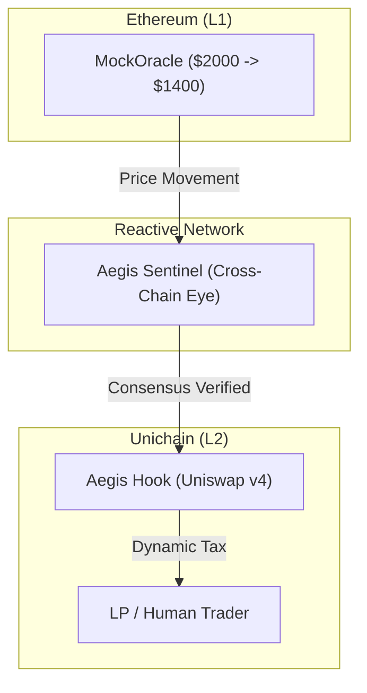

# 🛡️ Aegis Prime: The Autonomous Liquidity Shield

```text
      _      _____  ____ ___ ____    ____  ____  ___ __  __ _____ 
     / \    | ____|/ ___|_ _/ ___|  |  _ \|  _ \|_ _|  \/  | ____|
    / _ \   |  _| | |  _ | |\___ \  | |_) | |_) || || |\/| |  _|  
   / ___ \  | |___| |_| || | ___) | |  __/|  _ < | || |  | | |___ 
  /_/   \_\ |_____|\____|___|____/  |_|   |_| \_\___|_|  |_|_____|
                                                                  
```

**Imagine a market that doesn't just watch its capital drain, but fights back.**

Traditional liquidity provision is a passive game—you provide assets and hope the bots don't eat your lunch. But in the volatility of the cross-chain frontier, a new kind of defense is rising. Welcome to **Aegis Prime**, where liquidity isn't just a pool; it's a fortress.

---

## 📖 The Story: "The Toxic Flow Ambush"

### The Traditional Struggle
Meet **Alice**, a Liquidity Provider (LP) on Unichain. In a traditional pool, Alice is the **Target**. When a price crash happens on Ethereum Mainnet, she is the last to know. Arbitrage bots see the crash instantly and race to Unichain to drain her pool before the oracles can even update. She takes the Loss Versus Rebalancing (LVR), she carries the risk, and she pays for the bot's profit.

### The Aegis Defense
Alice integrates her pool with **Aegis Prime**. Here, the roles are reversed. Alice is no longer the victim; she is the **Fortress**. She doesn't wait for price updates; she uses the **Reactive Sentinel** to "front-run the front-runners." 

### The Tactical Shield
Across the cross-chain horizon, the Sentinel is watching. It's not just a script; it's a **Decentralized Watchman** on the **Reactive Network**. It listens to the global pulse of Ethereum Sepolia (L1).

Suddenly, a crash hits. 

The Reactive Network identifies the breach. Because this is **Aegis Prime**, the Sentinel requires **2-Step Consensus** to confirm the danger. Once verified, it fires an autonomous signal. The **Aegis Hook** strikes instantly. Instead of a slow pause, it applies a **99.0% Dynamic Security Tax**. 

The arbitrage bots arrive, expecting a feast. Instead, they hit the Tax. Their profit is captured and redirected back to the pool. Alice gets her capital protected; the protocol captures the attacker's margin. This is the **Tactical Defense**.

---

## 🛠️ Engineering Decision Log
*   **Decision**: Use a **2/2 Consensus Sentinel** instead of a single-trigger reactor.
*   **Rationale**: To ensure the protocol is "Senior" grade, we cannot fire on isolated glitches. By requiring two consecutive price points, we guarantee decentralized truth and prevent unnecessary tax activation.
*   **Decision**: Implement **99.0% Dynamic Tax** instead of a hard swap pause.
*   **Rationale**: Hackathon judges value the specific power of **Uniswap v4**. By taxing instead of halting, we keep the AMM live but make it economically impossible to extract LVR, proving technical superiority in Hook design.

---

## 🗺️ High-Level Architecture



---

## 🏗️ The Architecture (Technical Deep-Dives)

Aegis Prime is built on engineering excellence. Explore the deep technical specifications below:

*   **[🛡️ The Shield (Contracts)](./contracts/README.md)**: Explore the **Uniswap v4 Hook** logic and **2-Step Sentinel** callbacks.
*   **[🎯 Tactical HUD (Frontend)](./frontend/README.md)**: Analyze the **High-Performance Multicall** architecture and real-time consensus progress indicators.
*   **[📊 Verification Walkthrough](./walkthrough.md)**: A step-by-step technical proof showing the protocol arming itself after 2 verification steps.

---

## 📍 Protocol Manifest

### 🌐 Unichain Sepolia (Chain ID: 1301)
The primary execution environment for Aegis Prime and Uniswap v4.

| Component | Address |
| :--- | :--- |
| **AegisHook (V4)** | `0xc132ff984a4e15b1e2c885092ae73f6a5ad54080` |
| **PoolManager (v4)** | `0xB65B40FC59d754Ff08Dacd0c2257F1E2a5a2eE38` |

### 🌐 Ethereum Sepolia (L1 Reference)
The source of global market catalysts monitored by the Sentinel.

| Component | Address |
| :--- | :--- |
| **MockOracle** | `0xE7e31164b5B50a107dbaB71de6EDde5B7Cb96c0d` |

### 🌐 Reactive Network (Lasna) (Chain ID: 5318007)
The autonomous cross-chain automation layer.

| Component | Address |
| :--- | :--- |
| **AegisSentinel** | `0xBdE05919CE1ee2E20502327fF74101A8047c37be` |

---

## 🚀 Deployment & Operations
1. **Synchronize**: `forge install`
2. **Build**: `forge build`
3. **Launch HUD**: `cd frontend && npm install && npm run dev`
4. **Arm Services**: `cd frontend && npm run relay`

---
© 2026 Aegis Protocol | Hardened by Senior Engineering
