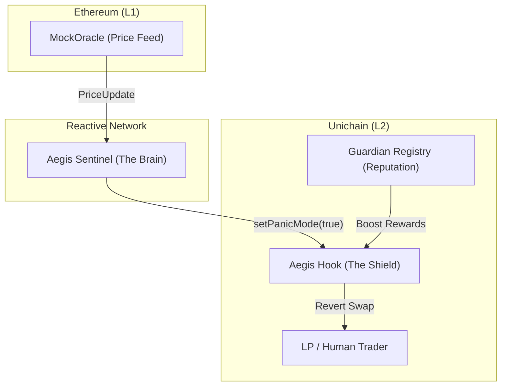

# 🛡️ Aegis: The Autonomous Liquidity Shield

```text
      _      _____  ____ ___ ____ 
     / \    | ____|/ ___|_ _/ ___|
    / _ \   |  _| | |  _ | |\___ \ 
   / ___ \  | |___| |_| || | ___) |
  /_/   \_\ |_____|\____|___|____/ 
                                   
```

**Stop reacting to the market. Let the market react to you.**

Aegis is a production-hardened, **Reactive Circuit Breaker** designed to protect Uniswap v4 Liquidity Providers from toxic flow and Loss Versus Rebalancing (LVR). By leveraging the **Reactive Network**, Aegis identifies market volatility on Ethereum L1 and autonomously gates L2 liquidity—"front-running the front-runners" before the first toxic trade can land.

---

## 📖 The Story: "The Temporal Arbitrage Crisis"

### The Traditional Exploit
Imagine a price crash on Ethereum Mainnet. Arbitrage bots see it instantly. They race to Layer 2 chains where price oracles are lagging by several blocks. Before the L2 pool can adjust, these "Toxic Flow" bots have already drained value from the Liquidity Providers (LPs). This is **LVR (Loss Versus Rebalancing)**, and it costs the ecosystem billions.

### The Aegis Defense
Aegis changes the game. Our **Reactive Sentinel** sits on the bridge between chains. It doesn't wait for a slow oracle update or a manual intervention. 

1. **Detection**: The moment a large price deviation is emitted on Ethereum L1 (Sepolia), the Sentinel catches it.
2. **Intervention**: Within the same block cycle, the Sentinel fires an autonomous, cross-chain callback to the **AegisHook** on Unichain.
3. **The Shield**: The Hook instantly flips to **Panic Mode**, pausing swaps and protecting LP capital from toxic arbitrage.

When the market stabilizes, Aegis autonomously restores the flow, rewarding the **Guardians** who stayed at their posts.

---

## 🛠️ Engineering Decision Log

*   **Decision**: Implement **O(1) Incremental Volume Tracking** in the Registry.
*   **Rationale**: The junior implementation used O(n) loops to calculate agent reputation, which would fail as the system scaled to thousands of interventions. We refactored this to a "Cumulative Cache" model, ensuring reputation lookups always take constant time regardless of history length.
*   **Decision**: Deploy a **Hybrid Relayer Model** (Reactive Network + Polling Fallback).
*   **Rationale**: For a high-stakes circuit breaker, 100% liveness is non-negotiable. While the Reactive Network provides decentralized autonomy, our hybrid TypeScript relayer provides **Sub-Second UX Latency** and RPC redundancy, guaranteeing the shield is "Armed and Online" even during network congestion.

---

## 🏗️ Integrated Architecture



---

## 🏛️ The Three Pillars (Technical Deep-Dives)

The Aegis Protocol is engineered for resilience, gas efficiency, and verified identity. Explore the specifications:

*   **[🛡️ The Shield & The Brain (Contracts)](./contracts/README.md)**: Explore the **Uniswap v4 Hook** logic, **Reactive Sentinel** cross-chain callbacks, and gas-saving storage packing.
*   **[🎯 The Tactical Dashboard (Frontend)](./frontend/README.md)**: Deep dive into the **Viem/Multicall** state management and real-time "Armed Status" HUD.
*   **[📊 Verification Walkthrough](./walkthrough.md)**: A step-by-step technical proof showing the circuit breaker in action during a live $1000 price crash.

---

## 📍 Protocol Manifest (Live Deployments)

### 🌐 Unichain Sepolia (Chain ID: 1301)
*   **AegisHook (V4)**: `0x71E998095a5830F5971c2589af26268Fc5B48080`
*   **GuardianRegistry**: `0x17F1CfD993aCCC5E9190984835d4D07Dfb48d8e3`
*   **PoolManager (v4)**: `0xB65B40FC59d754Ff08Dacd0c2257F1E2a5a2eE38`

### 🌐 Ethereum Sepolia (L1 Trigger)
*   **MockOracle**: `0xe7e31164b5b50a107dbab71de6edde5b7cb96c0d`

### 🌐 Reactive Network (Lasna) (Chain ID: 5318007)
*   **AegisSentinel**: `0xED6224cdC75A1FD962b0Bf462D754645DfFF1c02`

---

## 🚀 Quick Setup

1. **Install Submodules**: `forge install`
2. **Build Contracts**: `forge build`
3. **Run E2E Test**: `forge test --match-contract AegisIntegrationTest -vv`
4. **Launch HUD**: `cd frontend && npm install && npm run dev`

---
© 2026 Aegis Protocol | Hardened by Senior Engineering
