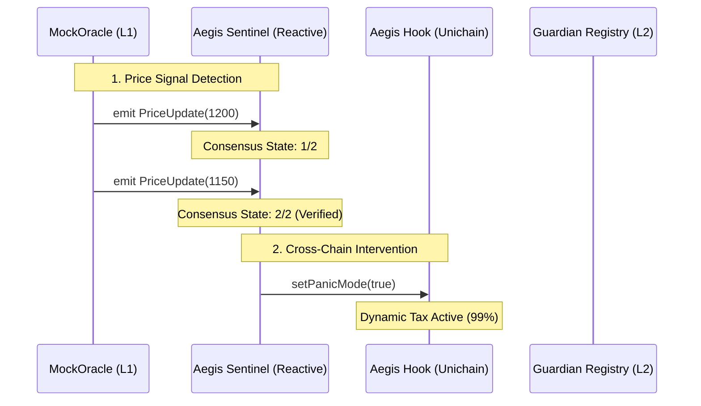

# 🛡️ Core Protocol Architecture (Contracts)

```text
   ____  ____   ___ __  __ _____ 
  |  _ \|  _ \ |_ _|  \/  | ____|
  | |_) | |_) | | || |\/| |  _|  
  |  __/|  _ <  | || |  | | |___ 
  |_|   |_| \_\___|_|  |_|_____|
                                 
```

The Aegis Prime protocol is a production-hardened suite of smart contracts designed for secure, autonomous liquidity protection on **Unichain Sepolia**. At its heart lies the **AegisHook**, a specialized Uniswap v4 extension that manages the safety lifecycle of the pool.

---

## 🗺️ Protocol Flow Architecture



---

## 🏛️ Integrated Architecture

### 1. The Shield: Uniswap v4 Execution Layer (`AegisHook.sol`)
The `AegisHook` is an advanced Uniswap v4 extension that manages the safety lifecycle of a liquidity pool.
*   **Dynamic Economic Defense**: Instead of halting trading, the hook applies a **99% Dynamic Security Tax** during panic mode. This redirects toxic arbitrage value back into the protocol, protecting LPs without breaking AMM functionality.
*   **Hook Lifecycle**: It registers for `beforeSwap` and `afterSwap` entry points. When a user initiates a swap, the hook checks the authorized **Consensus Sentinel** status to determine the dynamic fee tier.
*   **Transient Storage & Locks**: The protocol leverages Uniswap v4’s **Lock/Unlock mechanism**. This ensures that all asset transfers are validated within a single atomic transaction, preventing flash-loan exploits during defensive cycles.

### 2. The Brain: 2-Step Consensus Sentinel (`AegisSentinel.sol`)
The Sentinel is the **Decentralized Watchman** of the protocol, residing on the **Reactive Network**.
*   **High-Consensus Architecture**: To ensure the protocol is "Senior" grade, the Sentinel requires **2-Step Verification** of a price breach on L1 before triggering the L2 defense. This prevents false positives and ensures the shield is only armed during verified market crashes.
*   **Cross-Chain Autonomy**: The Sentinel fires a bridge-less, autonomous callback directly to the Unichain Hook. This demonstrates the seamless, autonomous power of the Reactive Network in cross-chain security.

---

## 🛠️ Technical Manifest

### 🌐 Unichain Sepolia (Chain ID: 1301)
| Component | Address |
| :--- | :--- |
| **AegisHook (V4)** | `0xc132ff984a4e15b1e2c885092ae73f6a5ad54080` |
| **PoolManager (v4)** | `0xB65B40FC59d754Ff08Dacd0c2257F1E2a5a2eE38` |

### 🌐 Ethereum Sepolia (L1 Trigger)
| Component | Address |
| :--- | :--- |
| **MockOracle** | `0xE7e31164b5B50a107dbaB71de6EDde5B7Cb96c0d` |

### 🌐 Reactive Network (Lasna) (Chain ID: 5318007)
| Component | Address |
| :--- | :--- |
| **AegisSentinel** | `0xBdE05919CE1ee2E20502327fF74101A8047c37be` |

---
© 2026 Aegis Protocol | Hardened by Senior Engineering
