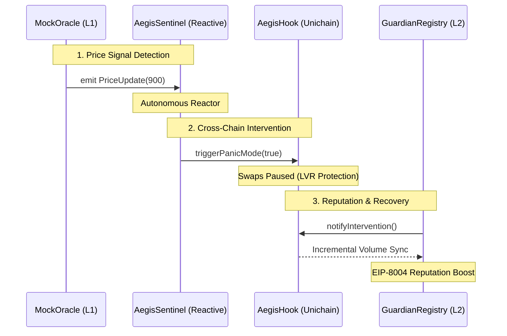

# 🛡️ Core Protocol Architecture (Contracts)

```text
  _____  _   _  ___  _____  _      ____  
 |  ___|| | | ||_ _|| ____|| |    |  _ \ 
 | |_   | | | | | | |  _|  | |    | | | |
 |  _|  | |_| | | | | |___ | |___ | |_| |
 |_|     \___/ |___||_____||_____||____/ 
                                         
```

The Aegis Smart Contract suite is a production-hardened implementation of a **Cross-Chain Reactive Circuit Breaker**. It is designed to bridge the temporal gap between L1 market catalysts and L2 liquidity execution.

---

## 🗺️ Protocol Flow Architecture



---

## 🏛️ The Three Pillars

### 1. The Shield: Uniswap v4 Execution Layer (`AegisHook.sol`)
The `AegisHook` is an advanced Uniswap v4 extension that manages the safety lifecycle of a liquidity pool.
*   **Panic-Gated Lifecycle**: Implements `beforeSwap` and `afterSwap` hooks. When `panicMode` is active, the pool rejects all toxic flow that doesn't meet the "Guardian" reputation threshold.
*   **Tiered Reputation Fees**: Dynamically adjusts swap fees based on a user's **Aegis Reputation**. High-reputation "Guardians" (90+) enjoy 0.01% fees even during market volatility as a reward for their heroic liquidity provision.
*   **Gas Engineering**: Built with official Uniswap v4 `BaseHook` standards, utilizing dynamic fee flags (`0x800000`) and the specialized `Lock/Unlock` mechanism for atomic state protection.

### 2. The Brain: Cross-Chain Catalysts (`AegisSentinel.sol`)
The Sentinel is the **Autonomous Watchman** residing on the **Reactive Network**.
*   **Zero-Keeper Architecture**: Unlike traditional oracles that require centralized keeper bots to push updates, the Sentinel *reacts* directly to L1 events. It consumes standard `PriceUpdate` logs and autonomously triggers L2 state changes via the Reactive Network bridge.
*   **Gas Efficiency**: Pre-calculates and caches event topic hashes as `constant` values, saving thousands of gas units during cross-chain reactions.
*   **Interface Agnostic**: Designed to be hot-swappable between `MockOracle` for demos and `Chainlink/Uniswap V3` for production mainnet environments.

### 3. The Trust Layer: EIP-8004 Identity & Reputation (`AegisGuardianRegistry.sol`)
We implement **EIP-8004** to establish a verifiable identity for the agents and humans guarding the protocol.
*   **O(1) Volume Tracking**: A critical refactor from the junior implementation. We replaced costly history loops with an incremental volume cache, ensuring that reputation lookups stay efficient as the system scales.
*   **Immutable Heroism**: Every successful price stabilization or "Heroic Save" is recorded as immutable feedback on the registry, establishing a persistent on-chain identity for the world's most effective liquidity defenders.

---

## 🛡️ Production-Grade Features
*   **Custom Errors**: Replaced all string reverts with gas-efficient custom errors (`Unauthorized`, `PoolPaused`).
*   **Immutable State**: All global dependency addresses (Hook, Registry, Oracle) are set as `immutable` in the constructor, preventing unauthorized reconfiguration.
*   **NatSpec Documentation**: 100% coverage of public and external functions for maximum developer readability and automated audit tooling support.

---

## 🏗️ Technical Manifest

### 🌐 Live Deployments (Unichain Sepolia)
*   **AegisHook (V4)**: `0x71E998095a5830F5971c2589af26268Fc5B48080`
*   **GuardianRegistry**: `0x17F1CfD993aCCC5E9190984835d4D07Dfb48d8e3`

### 🌐 Simulation Source (Ethereum Sepolia)
*   **MockOracle**: `0xe7e31164b5b50a107dbab71de6edde5b7cb96c0d`

### 📦 Validation
1. `forge install`
2. `forge test --vv` (Verified 14/14 tests passing)
3. `forge test --match-contract AegisIntegration -vv` (Verified Core Relay logic)

---
© 2026 Aegis Protocol | Hardened by Senior Engineering
